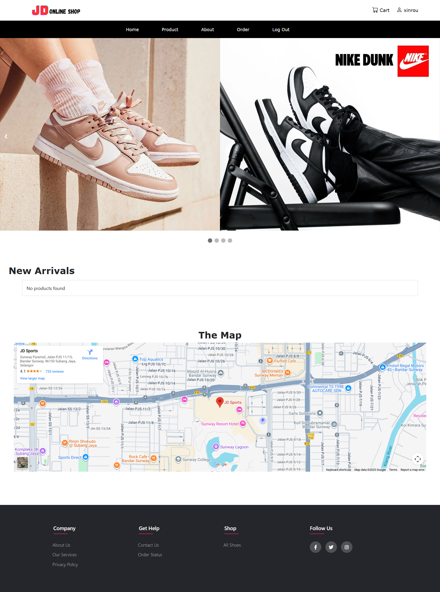
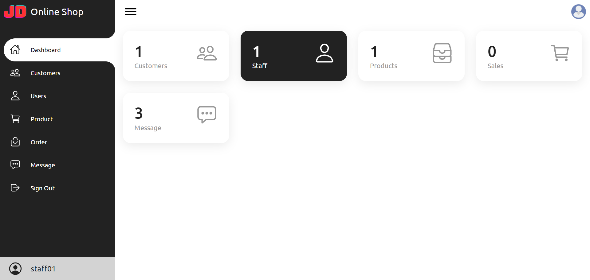

# JD ONLINE SHOP WEBSITE

A full-featured eCommerce website built from scratch using native PHP, MySQL, HTML, CSS, and JavaScript. This project simulates a real-world online shopping experience, from user registration and product browsing to a complete checkout process. It is designed to be a practical learning project for web development and a solid foundation for more complex eCommerce systems.

## ✨ Features

### Client-Side (User)
-   **User Authentication**: Secure user registration, login, and logout functionality.
-   **Customer Dashboard**: View and update personal profiles, and change passwords.
-   **Product Catalog**: Browse products on the homepage and view detailed information on product pages.
-   **Shopping Cart**: Add products to the cart, view cart items, update quantities, and remove items.
-   **Checkout Process**: Seamlessly proceed from cart to checkout, enter shipping details, and place an order.
-   **Order Management**: View past order history and details, and generate invoices.
-   **Static Pages**: Informational pages like "About Us," "Contact Us," "Our Services," and "Privacy Policy."

### Admin-Side (Administrator)
-   **Admin Dashboard**: A central hub for managing the entire store.
-   **Product Management**: Add, view, edit, and delete products from the catalog.
-   **User Management**: View and manage all registered customer accounts.
-   **Order Management**: Track all customer orders and update their statuses (e.g., pending, shipped, delivered).

## 🛠️ Technology Stack

-   **Backend**: PHP
-   **Database**: MySQL (managed via MariaDB in XAMPP)
-   **Frontend**: HTML, CSS, JavaScript
-   **Web Server**: Apache (via XAMPP)
-   **Development Environment**: XAMPP

## 🖼️ Screenshots

| Homepage | Admin Dashboard |
|:---:|:---:|
|  |  |

## 🚀 Getting Started: Setup and Installation

Follow these steps to get the project running on your local machine.

### 1. Prerequisites
-   Ensure you have **[XAMPP](https://www.apachefriends.org/index.html)** installed on your computer.

### 2. Installation Steps
1.  **Download or Clone the Project**
    -   Download and unzip the project folder or clone it using Git.

2.  **Move to `htdocs`**
    -   Copy the entire project folder into your XAMPP `htdocs` directory.
    -   Example path: `C:\xampp\htdocs\jd-online-shop`

3.  **Start XAMPP**
    -   Open the XAMPP Control Panel and start the **Apache** and **MySQL** services.

4.  **Create and Import the Database**
    -   Open your web browser and navigate to `http://localhost/phpmyadmin/`.
    -   Click on **New** to create a new database. Name it `jd_db`.
    -   Select the newly created database from the left-hand sidebar.
    -   Click on the **Import** tab at the top.
    -   Click **Choose File** and select the `.sql` file located in the `sql/` directory of the project (e.g., `jd_db.sql`).
    -   Click **Go** to import the database schema and data.

### 3. Run the Application
-   You're all set! Open your browser and go to `http://localhost/your-project-folder-name/`.
-   Example: `http://localhost/jd-online-shop/`

## 🕹️ How to Use

-   **As a Customer**: Visit the site, browse products, register for a new account, and proceed through the shopping and checkout process.
-   **As an Administrator**: Navigate to the admin login page, typically at `http://localhost/jd-online-shop/admin/`. Log in with admin credentials to access the dashboard and manage the store.
    > **Note**: You can find or create an admin account by checking the `users` (or `admins`) table in the database via phpMyAdmin.